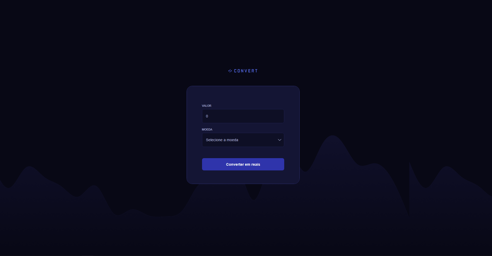
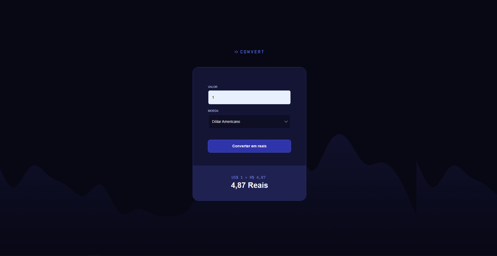
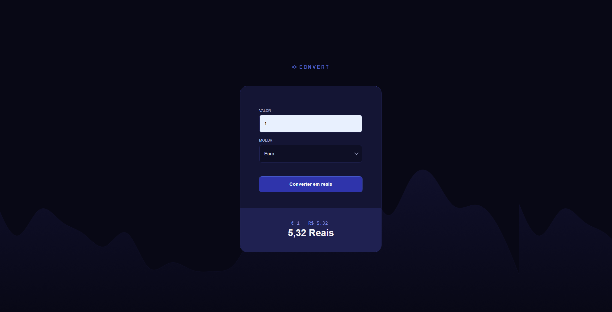
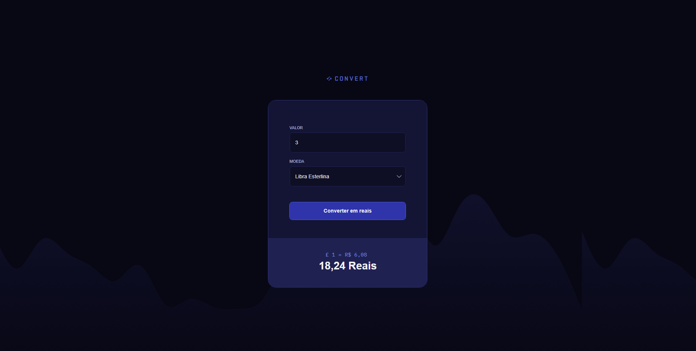

# Rocketseat

Projeto Rocketseat - CONVERT

## 🚀 Descrição

Projeto em desenvolvimento durante o curso Full Stack da Rocketseat (180h), com foco em JAVASCRIPT, converte moedas (DOLAR, EURO E LIBRA) para moeda local Brasileira.

## 📚 Conteúdo aplicado

- [x] Manipulação de Eventos
- [x] HTML5
- [x] CSS3
- [x] Manipulação do DOM
- [x] Debugs pelo browser
- [x] Regex

## Resultado

