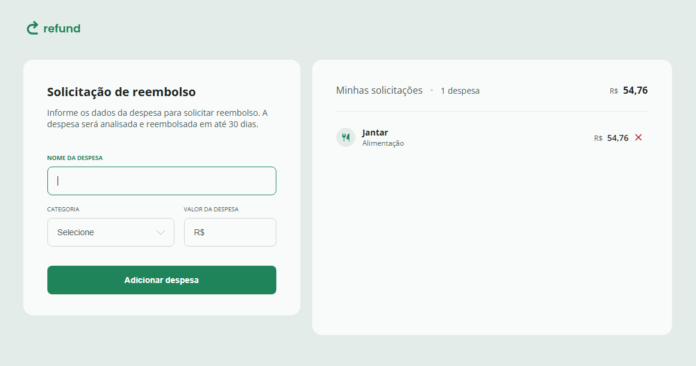
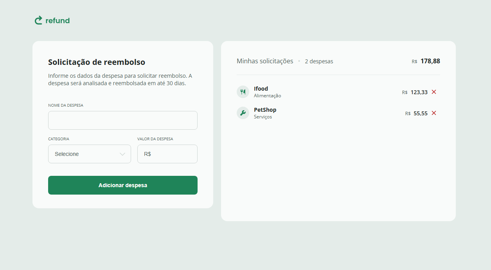
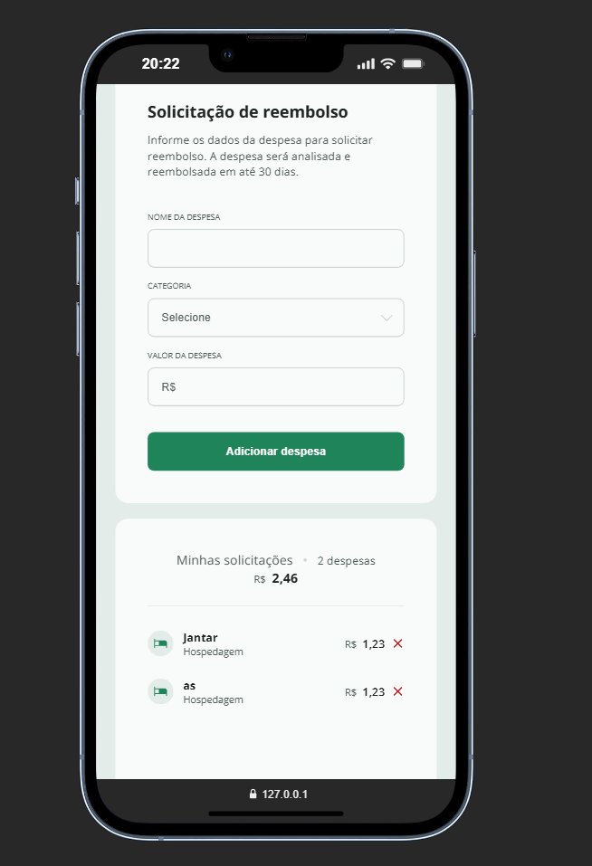

# Rocketseat

Projeto Rocketseat - Refund

## 🚀 Descrição

Projeto em desenvolvimento durante o curso Full Stack da Rocketseat, com foco em JAVASCRIPT, cria uma lista de informações de gastos.

## 📚 Conteúdo aplicado

- [x] Manipulação de Eventos
- [x] Mobile-First
- [x] HTML5
- [x] CSS3
- [x] Manipulação do DOM
- [x] Debugs pelo browser
- [x] Regex
- [x] Formatação de Moeda (Intl API)
- [x] Tratamento de Erros (try/catch)
- [x] Estruturas e Objetos em JS
- [x] Interação com Formulário
- [x] Atualização Dinâmica da UI

## Resultado

