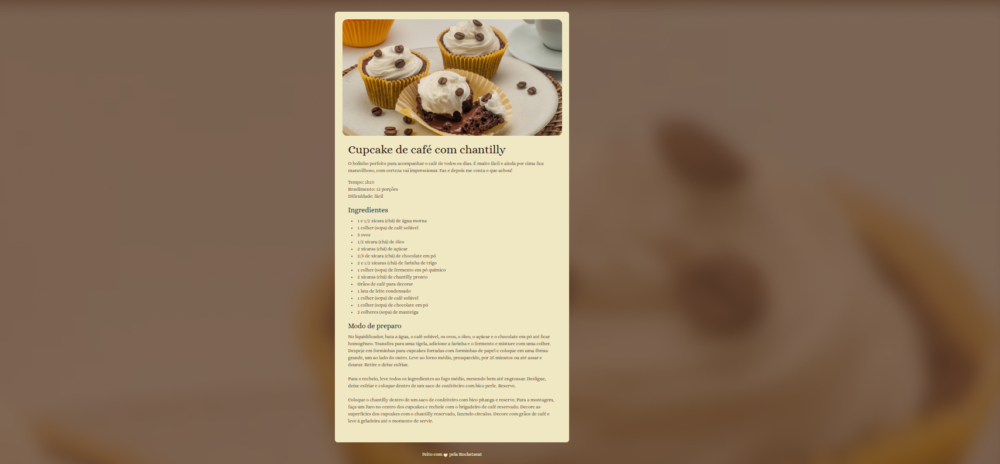

# Rocketseat

Todas as minhas aulas da Rocketseat do curso: Full-Stack

# Full Stack Origamid

## 🚀 Descrição

Projeto em desenvolvimento durante o curso Full Stack da Rocketseat (180h), com foco em aprender programação e ter uma base sólida.  
Este repositório demonstra o uso de tecnologias modernas de front-end e back-end com práticas reais de mercado.

## 📚 Conteúdo aplicado

https://www.notion.so/Full-Stack-236094895a2480129025ee49f61168a8?source=copy_link

- Versionamento com Git e GitHub
- HTML e CSS (semântico e responsivo)
- JavaScript moderno (ES6+)
- TypeScript
- Node.js e Express
- APIs RESTful
- Containers com Docker
- React (componentização, hooks, contexto)
- Integração front-end e back-end
- Desafio prático: HelpDesk

## 💻 Tecnologias utilizadas

- [ ] HTML5
- [ ] CSS3 / Tailwind (se usado)
- [ ] JavaScript
- [ ] TypeScript
- [ ] Node.js
- [ ] Express
- [ ] Docker
- [ ] React
- [ ] Git/GitHub

# Projeto de Receita: figma -> https://www.figma.com/community/file/1360315130061454535/pagina-de-receita

